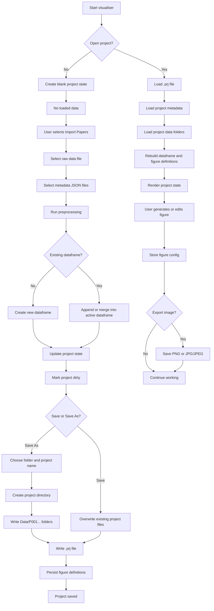

```mermaid
flowchart TD
    A[Start visualiser] --> B{Open project?}
    B -->|No| C[Create blank project state]
    C --> D[No loaded data]
    D --> E[User selects Import Papers]

    B -->|Yes| F[Load .prj file]
    F --> G[Load project metadata]
    G --> H[Load project data folders]
    H --> I[Rebuild dataframe and figure definitions]
    I --> J[Render project state]

    E --> K[Select raw data file]
    K --> L[Select metadata JSON files]
    L --> M[Run preprocessing]
    M --> N{Existing dataframe?}
    N -->|No| O[Create new dataframe]
    N -->|Yes| P[Append or merge into active dataframe]
    O --> Q[Update project state]
    P --> Q
    Q --> R[Mark project dirty]

    R --> S{Save or Save As?}
    S -->|Save| T[Overwrite existing project files]
    S -->|Save As| U[Choose folder and project name]
    U --> V[Create project directory]
    V --> W[Write Data/P001... folders]
    W --> X[Write .prj file]
    T --> X

    X --> Y[Persist figure definitions]
    Y --> Z[Project saved]

    J --> AA[User generates or edits figure]
    AA --> AB[Store figure config]
    AB --> AC{Export image?}
    AC -->|Yes| AD[Save PNG or JPG/JPEG]
    AC -->|No| AE[Continue working]
    AD --> AE
```